# Convexo Frontend — Sequence Diagrams

> UI flows, routing, API calls and state management.  
> Updated: 2026-04-10

---

## 1. SIWE Authentication Flow

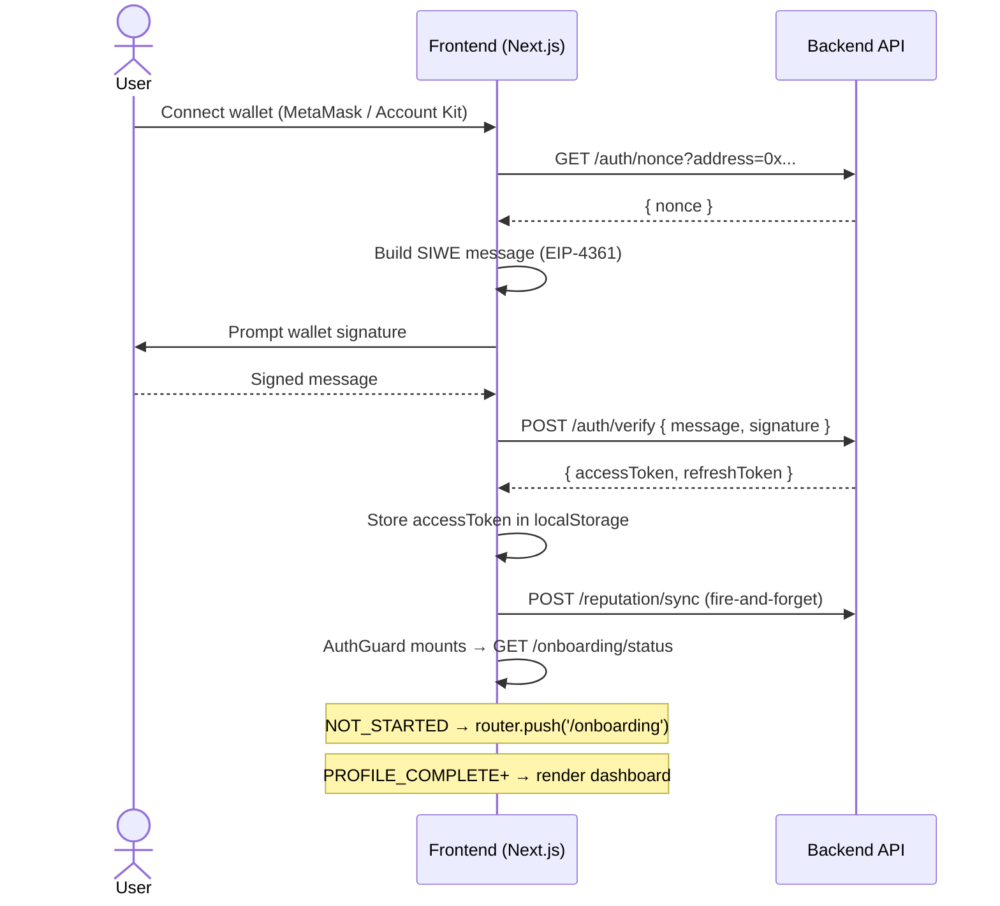
```mermaid
sequenceDiagram
    actor User
    participant FE as Frontend (Next.js)
    participant BE as Backend API

    User->>FE: Connect wallet (MetaMask / Account Kit)
    FE->>BE: GET /auth/nonce?address=0x...
    BE-->>FE: { nonce }
    FE->>FE: Build SIWE message (EIP-4361)
    FE->>User: Prompt wallet signature
    User-->>FE: Signed message
    FE->>BE: POST /auth/verify { message, signature }
    BE-->>FE: { accessToken, refreshToken }
    FE->>FE: Store accessToken in localStorage
    FE->>BE: POST /reputation/sync (fire-and-forget)
    FE->>FE: AuthGuard mounts → GET /onboarding/status
    Note over FE: NOT_STARTED → router.push('/onboarding')
    Note over FE: PROFILE_COMPLETE+ → render dashboard
```

**Key files:** `lib/hooks/useAuth.ts`, `lib/api/client.ts` (apiFetch)

---

## 2. Onboarding Wizard (Individual / Business)

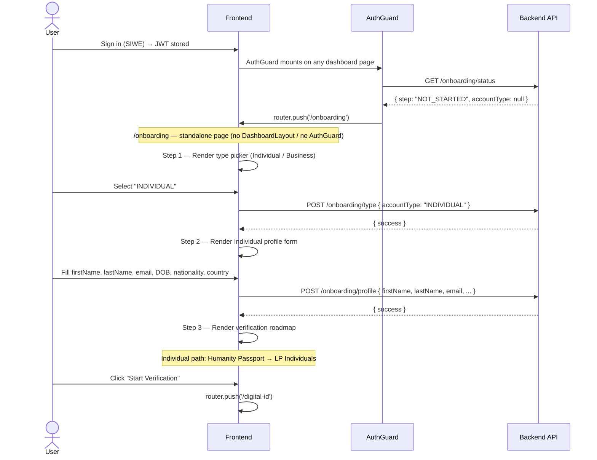
```mermaid
sequenceDiagram
    actor User
    participant FE as Frontend
    participant AG as AuthGuard
    participant BE as Backend API

    User->>FE: Sign in (SIWE) → JWT stored
    FE->>AG: AuthGuard mounts on any dashboard page
    AG->>BE: GET /onboarding/status
    BE-->>AG: { step: "NOT_STARTED", accountType: null }
    AG->>FE: router.push('/onboarding')

    Note over FE: /onboarding — standalone page (no DashboardLayout / no AuthGuard)

    FE->>FE: Step 1 — Render type picker (Individual / Business)
    User->>FE: Select "INDIVIDUAL"
    FE->>BE: POST /onboarding/type { accountType: "INDIVIDUAL" }
    BE-->>FE: { success }

    FE->>FE: Step 2 — Render Individual profile form
    User->>FE: Fill firstName, lastName, email, DOB, nationality, country
    FE->>BE: POST /onboarding/profile { firstName, lastName, email, ... }
    BE-->>FE: { success }

    FE->>FE: Step 3 — Render verification roadmap
    Note over FE: Individual path: Humanity Passport → LP Individuals
    User->>FE: Click "Start Verification"
    FE->>FE: router.push('/digital-id')
```

**Key files:** `app/onboarding/page.tsx`, `lib/hooks/useOnboarding.ts`

---

## 2b. Onboarding — Business Path

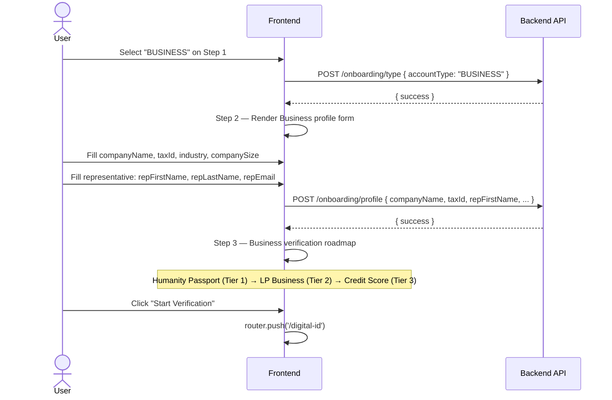
```mermaid
sequenceDiagram
    actor User
    participant FE as Frontend
    participant BE as Backend API

    User->>FE: Select "BUSINESS" on Step 1
    FE->>BE: POST /onboarding/type { accountType: "BUSINESS" }
    BE-->>FE: { success }

    FE->>FE: Step 2 — Render Business profile form
    User->>FE: Fill companyName, taxId, industry, companySize
    User->>FE: Fill representative: repFirstName, repLastName, repEmail
    FE->>BE: POST /onboarding/profile { companyName, taxId, repFirstName, ... }
    BE-->>FE: { success }

    FE->>FE: Step 3 — Business verification roadmap
    Note over FE: Humanity Passport (Tier 1) → LP Business (Tier 2) → Credit Score (Tier 3)
    User->>FE: Click "Start Verification"
    FE->>FE: router.push('/digital-id')
```

---

## 2c. Returning User (Onboarding Already Completed)

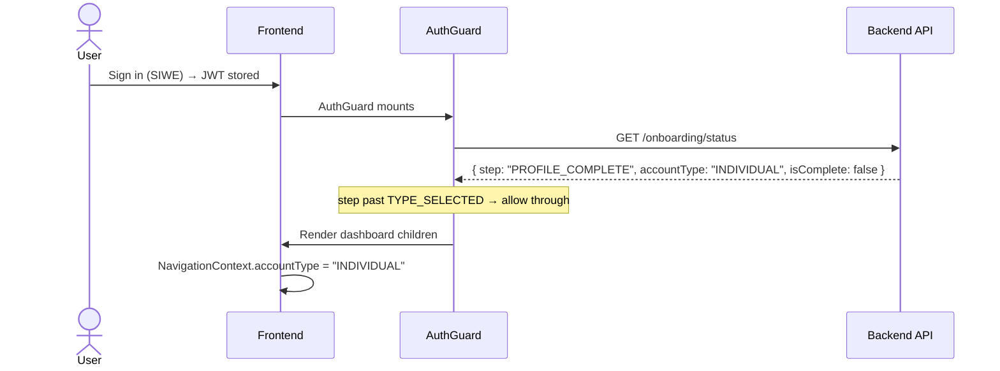
```mermaid
sequenceDiagram
    actor User
    participant FE as Frontend
    participant AG as AuthGuard
    participant BE as Backend API

    User->>FE: Sign in (SIWE) → JWT stored
    FE->>AG: AuthGuard mounts
    AG->>BE: GET /onboarding/status
    BE-->>AG: { step: "PROFILE_COMPLETE", accountType: "INDIVIDUAL", isComplete: false }
    Note over AG: step past TYPE_SELECTED → allow through
    AG->>FE: Render dashboard children
    FE->>FE: NavigationContext.accountType = "INDIVIDUAL"
```

**Key files:** `components/AuthGuard.tsx`, `lib/contexts/NavigationContext.tsx`

---

## 2d. Profile Page (Type-Aware Display)

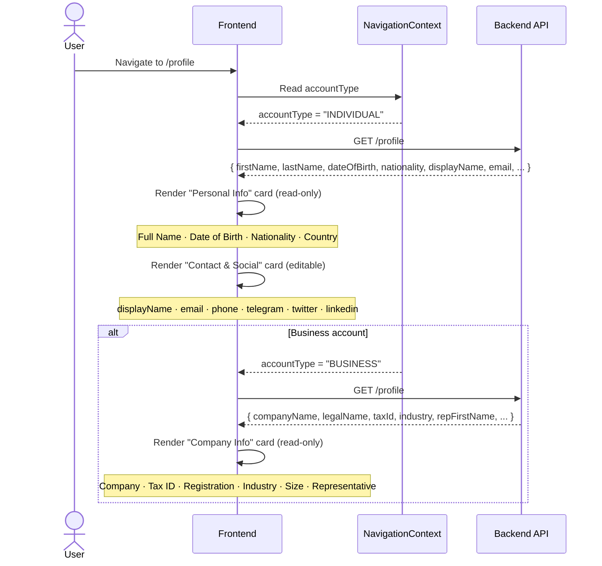
```mermaid
sequenceDiagram
    actor User
    participant FE as Frontend
    participant Nav as NavigationContext
    participant BE as Backend API

    User->>FE: Navigate to /profile
    FE->>Nav: Read accountType
    Nav-->>FE: accountType = "INDIVIDUAL"
    FE->>BE: GET /profile
    BE-->>FE: { firstName, lastName, dateOfBirth, nationality, displayName, email, ... }

    FE->>FE: Render "Personal Info" card (read-only)
    Note over FE: Full Name · Date of Birth · Nationality · Country
    FE->>FE: Render "Contact & Social" card (editable)
    Note over FE: displayName · email · phone · telegram · twitter · linkedin

    alt Business account
        Nav-->>FE: accountType = "BUSINESS"
        FE->>BE: GET /profile
        BE-->>FE: { companyName, legalName, taxId, industry, repFirstName, ... }
        FE->>FE: Render "Company Info" card (read-only)
        Note over FE: Company · Tax ID · Registration · Industry · Size · Representative
    end
```

**Key files:** `app/profile/page.tsx`

---

## 2e. Digital-ID Page (Account Type Filtering)

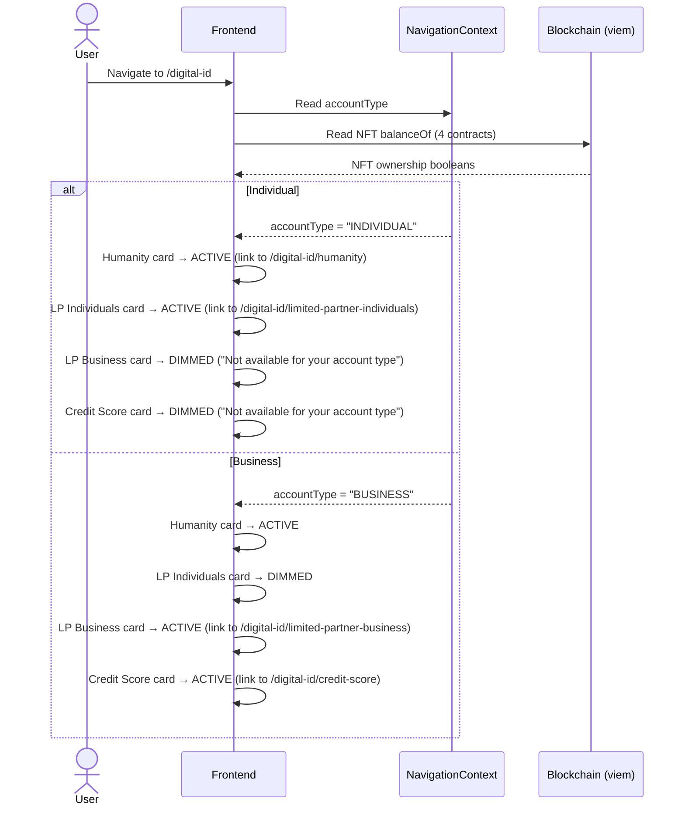
```mermaid
sequenceDiagram
    actor User
    participant FE as Frontend
    participant Nav as NavigationContext
    participant Chain as Blockchain (viem)

    User->>FE: Navigate to /digital-id
    FE->>Nav: Read accountType
    FE->>Chain: Read NFT balanceOf (4 contracts)
    Chain-->>FE: NFT ownership booleans

    alt Individual
        Nav-->>FE: accountType = "INDIVIDUAL"
        FE->>FE: Humanity card → ACTIVE (link to /digital-id/humanity)
        FE->>FE: LP Individuals card → ACTIVE (link to /digital-id/limited-partner-individuals)
        FE->>FE: LP Business card → DIMMED ("Not available for your account type")
        FE->>FE: Credit Score card → DIMMED ("Not available for your account type")
    else Business
        Nav-->>FE: accountType = "BUSINESS"
        FE->>FE: Humanity card → ACTIVE
        FE->>FE: LP Individuals card → DIMMED
        FE->>FE: LP Business card → ACTIVE (link to /digital-id/limited-partner-business)
        FE->>FE: Credit Score card → ACTIVE (link to /digital-id/credit-score)
    end
```

**Key files:** `app/digital-id/page.tsx`

---

## 3. KYC Verification (Individual — Veriff)

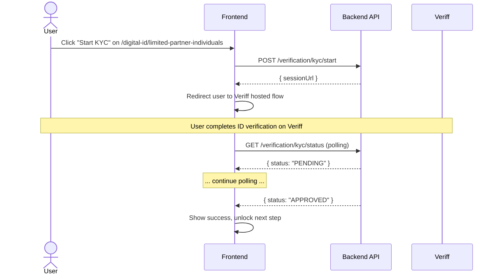
```mermaid
sequenceDiagram
    actor User
    participant FE as Frontend
    participant BE as Backend API
    participant Veriff

    User->>FE: Click "Start KYC" on /digital-id/limited-partner-individuals
    FE->>BE: POST /verification/kyc/start
    BE-->>FE: { sessionUrl }
    FE->>FE: Redirect user to Veriff hosted flow

    Note over User, Veriff: User completes ID verification on Veriff

    FE->>BE: GET /verification/kyc/status (polling)
    BE-->>FE: { status: "PENDING" }
    Note over FE: ... continue polling ...
    BE-->>FE: { status: "APPROVED" }
    FE->>FE: Show success, unlock next step
```

---

## 4. KYB Verification (Business — Sumsub)

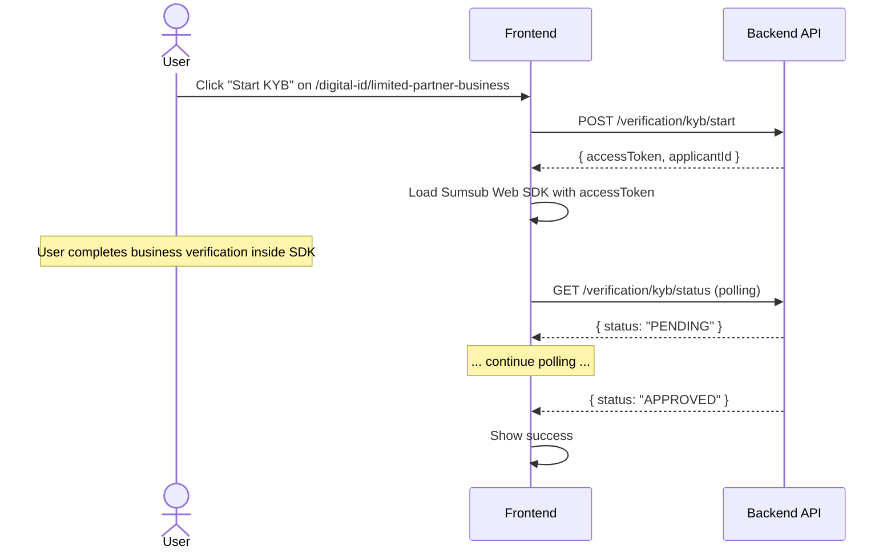
```mermaid
sequenceDiagram
    actor User
    participant FE as Frontend
    participant BE as Backend API

    User->>FE: Click "Start KYB" on /digital-id/limited-partner-business
    FE->>BE: POST /verification/kyb/start
    BE-->>FE: { accessToken, applicantId }
    FE->>FE: Load Sumsub Web SDK with accessToken

    Note over User: User completes business verification inside SDK

    FE->>BE: GET /verification/kyb/status (polling)
    BE-->>FE: { status: "PENDING" }
    Note over FE: ... continue polling ...
    BE-->>FE: { status: "APPROVED" }
    FE->>FE: Show success
```

---

## 5. Credit Score Submission (Business)

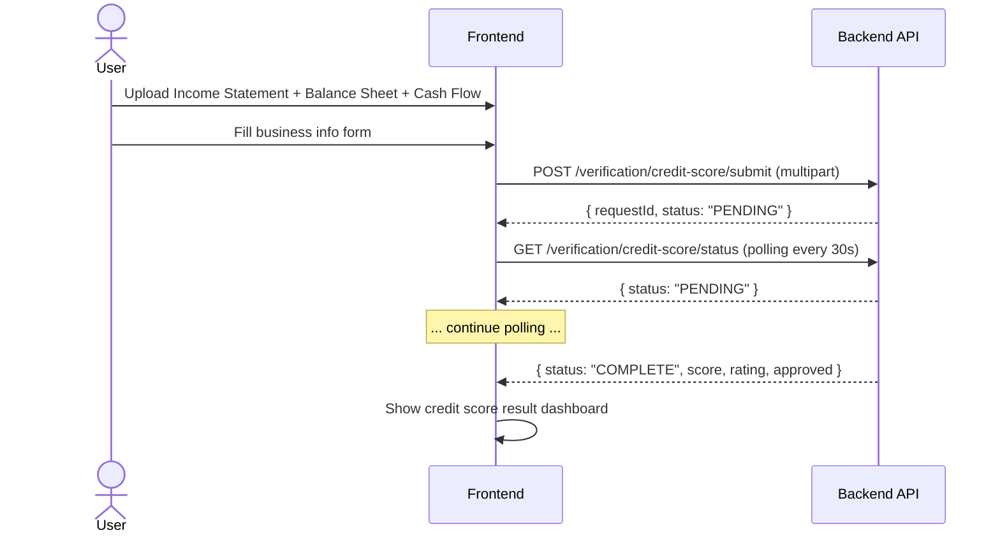
```mermaid
sequenceDiagram
    actor User
    participant FE as Frontend
    participant BE as Backend API

    User->>FE: Upload Income Statement + Balance Sheet + Cash Flow
    User->>FE: Fill business info form
    FE->>BE: POST /verification/credit-score/submit (multipart)
    BE-->>FE: { requestId, status: "PENDING" }

    FE->>BE: GET /verification/credit-score/status (polling every 30s)
    BE-->>FE: { status: "PENDING" }
    Note over FE: ... continue polling ...
    BE-->>FE: { status: "COMPLETE", score, rating, approved }
    FE->>FE: Show credit score result dashboard
```

---

## 6. OTC Orders

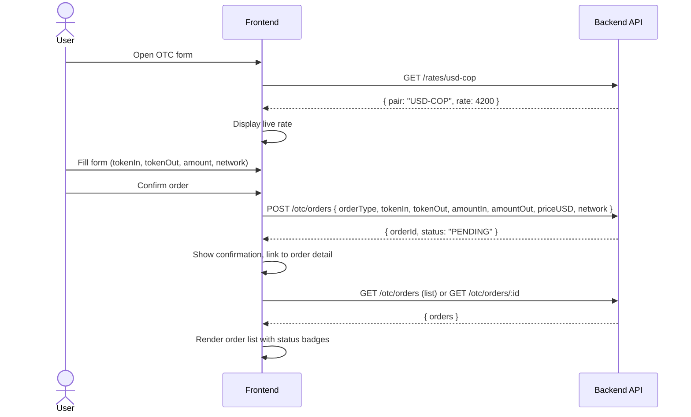
```mermaid
sequenceDiagram
    actor User
    participant FE as Frontend
    participant BE as Backend API

    User->>FE: Open OTC form
    FE->>BE: GET /rates/usd-cop
    BE-->>FE: { pair: "USD-COP", rate: 4200 }
    FE->>FE: Display live rate

    User->>FE: Fill form (tokenIn, tokenOut, amount, network)
    User->>FE: Confirm order
    FE->>BE: POST /otc/orders { orderType, tokenIn, tokenOut, amountIn, amountOut, priceUSD, network }
    BE-->>FE: { orderId, status: "PENDING" }
    FE->>FE: Show confirmation, link to order detail

    FE->>BE: GET /otc/orders (list) or GET /otc/orders/:id
    BE-->>FE: { orders }
    FE->>FE: Render order list with status badges
```

---

## 7. Reputation & Tier Gating

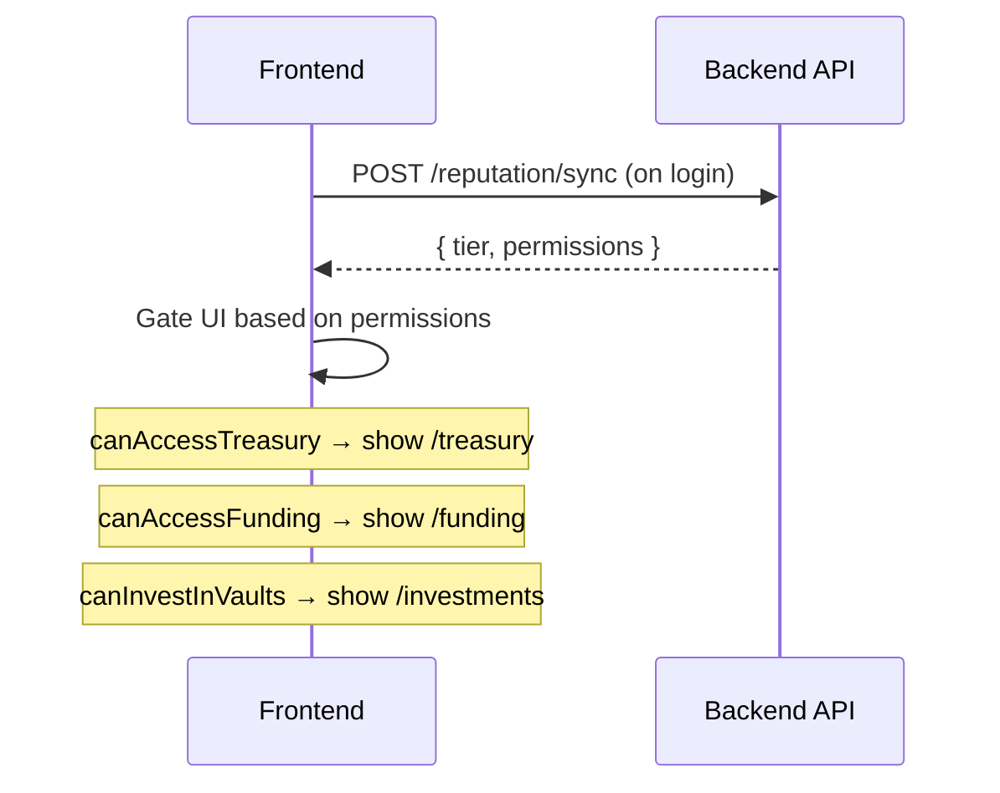
```mermaid
sequenceDiagram
    participant FE as Frontend
    participant BE as Backend API

    FE->>BE: POST /reputation/sync (on login)
    BE-->>FE: { tier, permissions }

    FE->>FE: Gate UI based on permissions
    Note over FE: canAccessTreasury → show /treasury
    Note over FE: canAccessFunding → show /funding
    Note over FE: canInvestInVaults → show /investments
```

**Key files:** `lib/contexts/NavigationContext.tsx`

---

## 8. Funding Requests (Business, Tier 3)

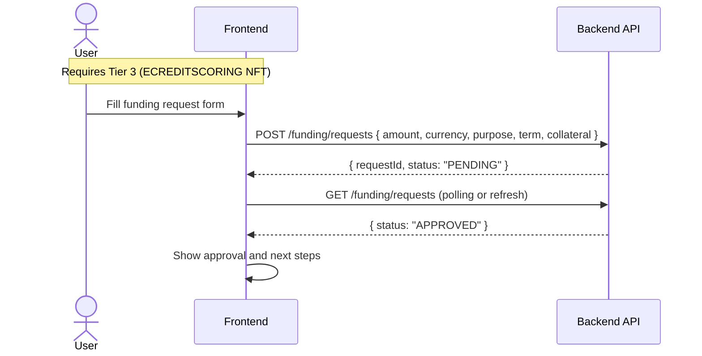
```mermaid
sequenceDiagram
    actor User
    participant FE as Frontend
    participant BE as Backend API

    Note over User,FE: Requires Tier 3 (ECREDITSCORING NFT)

    User->>FE: Fill funding request form
    FE->>BE: POST /funding/requests { amount, currency, purpose, term, collateral }
    BE-->>FE: { requestId, status: "PENDING" }

    FE->>BE: GET /funding/requests (polling or refresh)
    BE-->>FE: { status: "APPROVED" }
    FE->>FE: Show approval and next steps
```

---

## 9. Bank Account Management

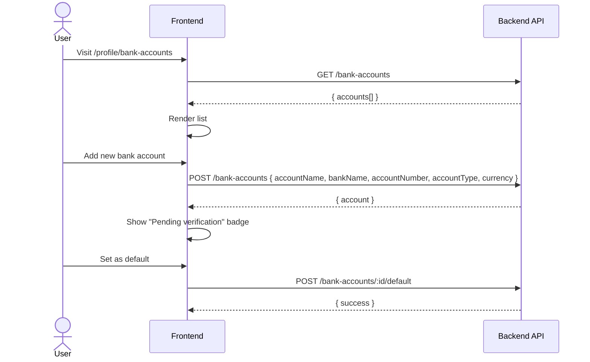
```mermaid
sequenceDiagram
    actor User
    participant FE as Frontend
    participant BE as Backend API

    User->>FE: Visit /profile/bank-accounts
    FE->>BE: GET /bank-accounts
    BE-->>FE: { accounts[] }
    FE->>FE: Render list

    User->>FE: Add new bank account
    FE->>BE: POST /bank-accounts { accountName, bankName, accountNumber, accountType, currency }
    BE-->>FE: { account }
    FE->>FE: Show "Pending verification" badge

    User->>FE: Set as default
    FE->>BE: POST /bank-accounts/:id/default
    BE-->>FE: { success }
```

---

## 10. Full User Journey

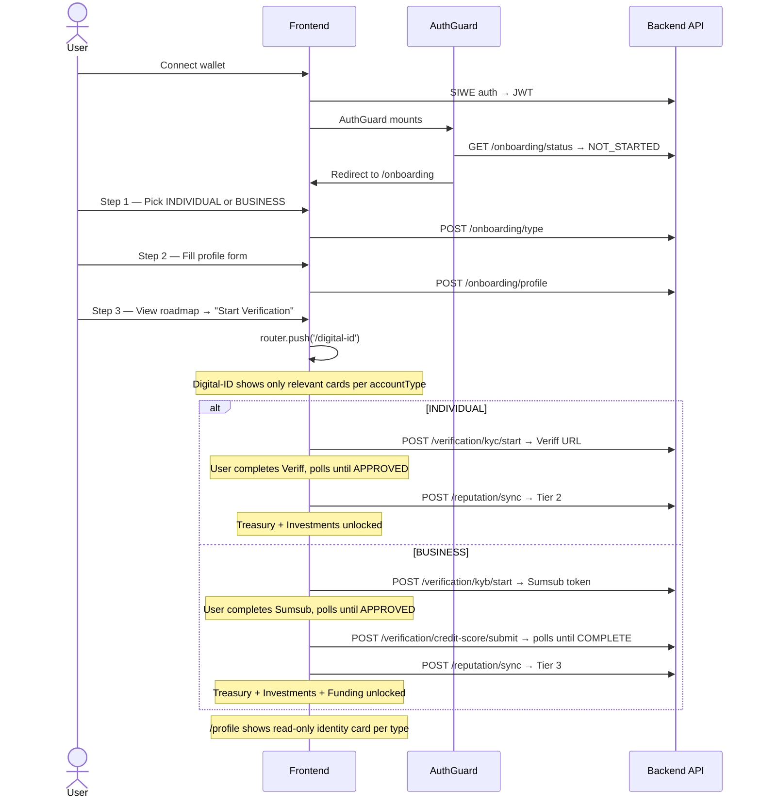
```mermaid
sequenceDiagram
    actor User
    participant FE as Frontend
    participant AG as AuthGuard
    participant BE as Backend API

    User->>FE: Connect wallet
    FE->>BE: SIWE auth → JWT

    FE->>AG: AuthGuard mounts
    AG->>BE: GET /onboarding/status → NOT_STARTED
    AG->>FE: Redirect to /onboarding

    User->>FE: Step 1 — Pick INDIVIDUAL or BUSINESS
    FE->>BE: POST /onboarding/type
    User->>FE: Step 2 — Fill profile form
    FE->>BE: POST /onboarding/profile
    User->>FE: Step 3 — View roadmap → "Start Verification"
    FE->>FE: router.push('/digital-id')

    Note over FE: Digital-ID shows only relevant cards per accountType

    alt INDIVIDUAL
        FE->>BE: POST /verification/kyc/start → Veriff URL
        Note over FE: User completes Veriff, polls until APPROVED
        FE->>BE: POST /reputation/sync → Tier 2
        Note over FE: Treasury + Investments unlocked
    else BUSINESS
        FE->>BE: POST /verification/kyb/start → Sumsub token
        Note over FE: User completes Sumsub, polls until APPROVED
        FE->>BE: POST /verification/credit-score/submit → polls until COMPLETE
        FE->>BE: POST /reputation/sync → Tier 3
        Note over FE: Treasury + Investments + Funding unlocked
    end

    Note over FE: /profile shows read-only identity card per type
```

---

## 11. Treasury — USDC/ECOP Pool Swap (Phase 6 — TO IMPLEMENT)

> **Pool live on Base Sepolia** (2026-04-10):
> Hook `0xdCfF77e89904e9Bead3f456D04629Ca8Eb7e8a80`, fee=500, tickSpacing=10, rate=3650 COP/USDC.
> Currently treasury/swaps shows rates but does NOT execute on-chain swaps yet.

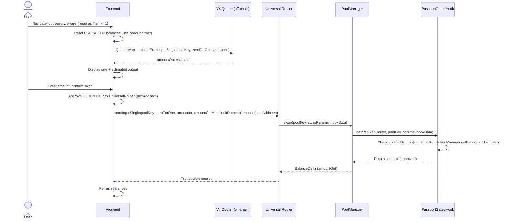
```mermaid
sequenceDiagram
    actor User
    participant FE as Frontend
    participant V4Q as V4 Quoter (off-chain)
    participant UR as Universal Router
    participant PM as PoolManager
    participant Hook as PassportGatedHook

    User->>FE: Navigate to /treasury/swaps (requires Tier >= 1)
    FE->>FE: Read USDC/ECOP balances (useReadContract)
    FE->>V4Q: Quote swap — quoteExactInputSingle(poolKey, zeroForOne, amountIn)
    V4Q-->>FE: amountOut estimate
    FE->>FE: Display rate + estimated output

    User->>FE: Enter amount, confirm swap
    FE->>FE: Approve USDC/ECOP to UniversalRouter (permit2 path)
    FE->>UR: exactInputSingle(poolKey, zeroForOne, amountIn, amountOutMin, hookData=abi.encode(userAddress))
    UR->>PM: swap(poolKey, swapParams, hookData)
    PM->>Hook: beforeSwap(router, poolKey, params, hookData)
    Hook->>Hook: Check allowedRouters[router] + ReputationManager.getReputationTier(user)
    Hook-->>PM: Return selector (approved)
    PM-->>UR: BalanceDelta (amountOut)
    UR-->>FE: Transaction receipt
    FE->>FE: Refresh balances
```

**Key implementation requirements:**
1. `allowRouter(universalRouterAddress)` must be called on the hook before any swap works
2. `hookData` must be `abi.encode(userAddress)` — the router passes who the real user is
3. Use V4 Quoter (`v4-periphery/src/lens/V4Quoter.sol`) for off-chain quotes
4. permit2 approve flow same as liquidity (already done in AddLiquidity.s.sol for reference)

**Key files to create/update:**
- `app/treasury/swaps/page.tsx` — wire `executeSwap()` using `useConvexoWrite`
- `lib/hooks/useV4Quote.ts` — off-chain quote hook
- `lib/contracts/addresses.ts` — add `UNIVERSAL_ROUTER` + `V4_QUOTER` per chain

---

## 12. Investments — Vault Flow (ERC-7540 Async Redemption)

> **VaultFactory deployed** (same address all chains, v3.18).
> TokenizedBondVault: ERC-7540 async redemption, `totalShareSupply` + `minInvestment` model.
> Currently /investments page exists but vault interaction not wired.

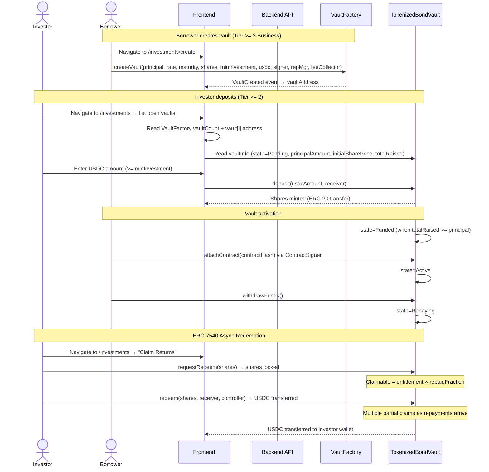
```mermaid
sequenceDiagram
    actor Investor
    actor Borrower
    participant FE as Frontend
    participant BE as Backend API
    participant VF as VaultFactory
    participant Vault as TokenizedBondVault

    Note over Borrower,VF: Borrower creates vault (Tier >= 3 Business)
    Borrower->>FE: Navigate to /investments/create
    Borrower->>VF: createVault(principal, rate, maturity, shares, minInvestment, usdc, signer, repMgr, feeCollector)
    VF-->>FE: VaultCreated event → vaultAddress

    Note over Investor,Vault: Investor deposits (Tier >= 2)
    Investor->>FE: Navigate to /investments → list open vaults
    FE->>FE: Read VaultFactory vaultCount + vault[i] address
    FE->>Vault: Read vaultInfo (state=Pending, principalAmount, initialSharePrice, totalRaised)
    Investor->>FE: Enter USDC amount (>= minInvestment)
    FE->>Vault: deposit(usdcAmount, receiver)
    Vault-->>FE: Shares minted (ERC-20 transfer)

    Note over Borrower,Vault: Vault activation
    Vault->>Vault: state=Funded (when totalRaised >= principal)
    Borrower->>Vault: attachContract(contractHash) via ContractSigner
    Vault->>Vault: state=Active
    Borrower->>Vault: withdrawFunds()
    Vault->>Vault: state=Repaying

    Note over Investor,Vault: ERC-7540 Async Redemption
    Investor->>FE: Navigate to /investments → "Claim Returns"
    Investor->>Vault: requestRedeem(shares) → shares locked
    Note over Vault: Claimable = entitlement × repaidFraction
    Investor->>Vault: redeem(shares, receiver, controller) → USDC transferred
    Note over Vault: Multiple partial claims as repayments arrive
    Vault-->>FE: USDC transferred to investor wallet
```

**Vault economic model:**
- `initialSharePrice` = principalAmount / totalShareSupply (e.g. $100k / 1000 shares = $100/share)
- `expectedFinalPrice` = (principal + interest - fee) / totalShareSupply
- `minInvestment` = minimum USDC per deposit (e.g. $500 minimum)
- States: Pending → Funded → Active → Repaying → Completed / Defaulted

**Key files to create/update:**
- `app/investments/page.tsx` — list vaults from VaultFactory events
- `app/investments/[vaultId]/page.tsx` — vault detail + deposit + requestRedeem + redeem
- `lib/hooks/useVault.ts` — vault read/write hooks
